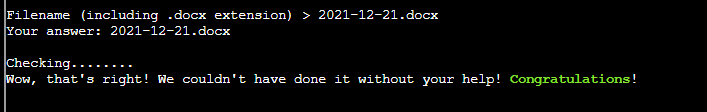

# 2) Where in the World is Caramel Santaigo

> Difficulty: 1/5
> 
> Help Tangle Coalbox find a wayward elf in Santa's courtyard. Talk to Piney Sappington nearby for hints.

Hints Provided by Piney Sappinton:  
- Don't forget coordinate systems other than lat/long like [MGRS](https://en.wikipedia.org/wiki/Military_Grid_Reference_System) and [what3words](https://what3words.com/).  
- While Flask cookies can't generally be forged without the secret, they can often be [decoded and read](https://gist.github.com/chriselgee/b9f1861dd9b99a8c1ed30066b25ff80b).  
- Clay Moody is giving [a talk](https://www.youtube.com/watch?v=tAot_mcBT9c) about OSINT techniques right now!

Answer: **Name of Elf varies each time you start the puzzle/game. Follow the solution below to find the way to solve the puzzle/game**

---

## Walkthrough

Tangle Coalbox is found in the _Santa's Couryard_. To get there from the entrance, First enter the Castle to a big room called _Entry_. From here, you can either:  
1. go to the left of the room to _Dining Room_, then exit from the north to reach _Santa's Courtyard_, OR
2. go to the right of the room to _Great Room_, and then exit from the north to reach _Santa's Courtyard_.

Interacting with Tangle Coalbox will reveals that he needs help using OSINT (Open-source intelligence) to find some elves who have been on misdirected journeys around the globe.

You are to use the vintage Cranberry Pi Terminal beside him to conduct your OSINT search for the elves.

He also pointed out that we can talk to Piney Sappinton (within the same courtyard near the right) to get more tips on this task. 

---
## Solution(hint)

Over at Piney Sappington, he says he needed help to look into a particular _tampered file_ within the Cranberry Pi terminal beside him. It has **Exiftool* installed on it to help with the investigation. Helping him with this task will get him to give us more hints to Tangle Coalbox's task.

Start up the terminal:

This task requires us to use **Exiftool** tool to figure out which document has been modifed/tampered by Jack Frost.

Do a quick `ls` to find out how many files there are on terminal.

We see that there are a total of 25 files that needs to be investigated.

Since the documents are numbered and ends with **.docx**, We can find out which file has last been modified by using the following command:  
`exiftool *.docx | grep "Last Modified By"`

Every file has been last modified by Santa Claus except for `2021-12-21.docx` which indicates last modification by Jack Frost.

Hence, the answer is: **2021-12-21.docs**

Exit the terminal and interact with Piney Sappington. He will reveal several hints to Tangle Coalbox's task.

Hints Provided by Piney Sappinton:  
- Don't forget coordinate systems other than lat/long like [MGRS](https://en.wikipedia.org/wiki/Military_Grid_Reference_System) and [what3words](https://what3words.com/).  
- While Flask cookies can't generally be forged without the secret, they can often be [decoded and read](https://gist.github.com/chriselgee/b9f1861dd9b99a8c1ed30066b25ff80b).  
- Clay Moody is giving [a talk](https://www.youtube.com/watch?v=tAot_mcBT9c) about OSINT techniques right now!

---
## Solution

Start up the terminal:

This puzzle is similar to the old `Where in the world is Carmen Santiago` that was famous during the 90's.  
Basically you start off in a random location in the world, and the game objective is to try to figure out the correct next location to go to by asking for directions at each location, as well as finding out which elf exactly are you looking for.
At each location, you are given 3 links provided as shown:

- The first link `Investigate` provides 3 areas for you to ask for clues. Each area provides 1 unique clue, revisiting the same area will provide the same clue. The clues can be clues about the next correct location, or certain characteristics of an elf for you to filter and pinpoint which elf you are exactly looking for.  
- The second link `Visit InterRink` is where you indicate the filters based on clues provided to pinpoint the exact elf you are looking for. **The elf to look for needs to be identified before reaching the final correct destination**.  
- The last link `Depart by sleigh` is where you choose to travel for your next destination.

**The constraint to this game is that every action consumes time, so you need to reach the elf in the fastest time possible.**

At the last location, you will not be able to use the third link anymore, and you have to Investigate to "catch" the elf, after which you need to choose the name of the elf you caught.

However after playing a few round, it seems that no matter how efficient one is at catching the clues and getting to the last location, the elf will always manage to escape:

Seems like a hack around the normal way of playing this game is needed.

Based on the clue given about the Flask cookies from Piney Sappington, open up the Browser Developer's Tool, and look at the cookie generated by this game:

There is a very long cookie value within the caramel cookie, Based on the hint provided. This is a flask cookie, which according to the [github](https://gist.github.com/chriselgee/b9f1861dd9b99a8c1ed30066b25ff80b) site, when this cookie is stored client-side, are `.`-delimited, zlip-deflated, and Base64-encoded, with `_` subbed in for `/` and `-` subbed in for `+` (URL-safe encoding).

Based on this steps of encoding and substitution, we can use the [CyberChef](https://gchq.github.io/CyberChef/) to reverse engineer the decoded text of this string:

What you see is basically the original human-readable string. This string contains a few information including:  
1. Name of the Elf  
2. Clues describing the characteristics of the Elf  
3. Clues describing the next location at each location
4. Route to to take to go from first to the last location

Using this, we can reach the last location without wasting time investigating or input characteristics to find out the name of the Elf we are catching.

At the last location, identify the Elf and you will get the achievement for winning the game!

