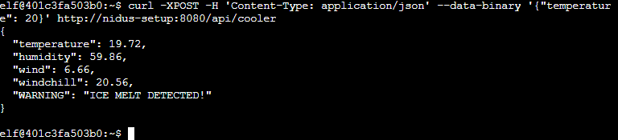

# 3) Thaw Frost Tower's Entrance

> Difficulty: 2/5
> 
> Turn up the heat to defrost the entrance to Frost Tower. Click on the `Items` tab in your badge to find a link to the Wifi Dongle's CLI interface. Talk to Greasy Gopherguts outside the tower for tips.

Hints provided by Greasy GopherGuts:
- The [iwlist](https://linux.die.net/man/8/iwlist) and [iwconfig](https://linux.die.net/man/8/iwconfig) utilities are key for managing Wi-Fi from the Linux command line.
- [cURL](https://linux.die.net/man/1/curl) makes HTTP requests from a terminal - in Mac, Linux, and modern Windows!
- When sending a [POST request with data](https://www.educative.io/edpresso/how-to-perform-a-post-request-using-curl), add `--data-binary` to your `curl` command followed by the data you want to send.

Answer: **Follow the solution below to melt the ice around the front door**

---

## Walkthrough

This objective requires the use of the Wifi Dongle that was found at the very beginning during Objective 01. You can find it in your Inventory. To understand the objective. You can proceed to the _Frost Tower_ on the right of the Santa's Castle and speak to Grimy Mctrollkins, who is standing outside the _Frost Tower_.

To get to the _Frost Tower_, go back to the _The North Pole_ (Step out of Santa's Castle) and proceed all the way to the right.

Interact with Grimy Mctrollkins and he is working for Jack Frost, the owner of the _Frost Tower_. He currently needs help with opening the front door of the _Frost Tower_ because Jack Frost is so obsessed with icy cold that he accidentally freeze shut the front door. To open the door, we need to get access to the thermostat inside the Castle and use the thermostat to melt the door open. The thermostat is accessible via the wifi provided by the Wifi Dongle in our inventory.

We can also look for Greasy Gopherguts who is also standing outside the _Frost Tower_ in the _The North Pole_ for tips to this objective. He is standing a little further to the right of Grimy Mctrollkins. 

---
## Solution(hint)

At Greasy GopherGuts, he said that he needed some help with some Nmap outputs. If we can provide him some results with that, he will give us some tips about the Wifi. We can assist with his task by using the terminal beside him.  
**This puzzle here is a test of your NMAP understanding interpretation of NMAP result. If you require some help with the `nmap` command or result, you can look for a cheatsheet online.**  
- Check [this](https://ryanstutorials.net/linuxtutorial/cheatsheetgrep.php) out if you need a `grep` refresher.

Start up the terminal:

We have to answer the following questions:  
1. What port does 34.76.1.22 have open?
2. What port does 34.77.207.226 have open?
3. How many hosts appear "Up" in the scan?
4. How many hosts have a web port open?  (Let's just use TCP ports 80, 443, and 8080)
5. How many hosts with status Up have no (detected) open TCP ports?
6. What's the greatest number of TCP ports any one host has open?

> Qn 1: What port does 34.76.1.22 have open?  

Command: `grep "34.76.1.22" bigscan.gnmap`  

Enter `quizme` and input the answer:

Answer: **62078**

> Qn 2: What port does 34.77.207.226 have open?  

Command: `grep "34.77.207.226" bigscan.gnmap`  

Enter `quizme` and input the answer:

Answer: **8080**

> Qn 3: How many hosts appear "Up" in the scan?

Command: `grep "Status: Up" bigscan.gnmap | wc -l`

Enter `quizme` and input the answer:

Answer: **26054**

> Qn 4: How many hosts have a web port open?  (Let's just use TCP ports 80, 443, and 8080)

Command: `grep -E "(80|443|8080)/open" bigscan.gnmap | wc -l`

Enter `quizme` and input the answer:

> Qn 5: How many hosts with status Up have no (detected) open TCP ports?

Commands:  
`STATUS_UP=$(grep Up bigscan.gnmap | wc -l)`  
`NO_OPEN=$(grep Ports bigscan.gnmap | wc -l)`  
`echo $(expr $STATUS_UP - $NO_OPEN)`

Enter `quizme` and input the answer:

Answer: **402**

> Qn 6: What's the greatest number of TCP ports any one host has open?

Commands:  
`grep -E "\(988\)" bigscan.gnmap`  
`grep -E "\(987\)" bigscan.gnmap`

Working backwards from closed/filtered ports of `1000` down to `987`, we will see that there is no result for `987`, so the biggest number of open ports will be `1000-988=12`

Enter `quizme` and input the answer:

Answer: **12**

Hints provided by Greasy GopherGuts:
- The [iwlist](https://linux.die.net/man/8/iwlist) and [iwconfig](https://linux.die.net/man/8/iwconfig) utilities are key for managing Wi-Fi from the Linux command line.
- [cURL](https://linux.die.net/man/1/curl) makes HTTP requests from a terminal - in Mac, Linux, and modern Windows!
- When sending a [POST request with data](https://www.educative.io/edpresso/how-to-perform-a-post-request-using-curl), add `--data-binary` to your `curl` command followed by the data you want to send.

---
## Solution

Start up the Wifi Dongle CLI interface by going to your inventory and click `Open WiFi CLI`:

In summary, `iwlist` command allows you to scan the surrounding location for any available WiFi network, while `iwconfig` command allows you to connect to an available WiFI network.

try the following command to find an available WiFi network: `iwlist scanning`

If there is no WiFi network listed, walk around the _Frost Tower_ Castle and try at a different spot near the Castle.

Next, attempt to connect to the Wifi Network using the following command: `iwconfig wlan0 essid FROST-Nidus-Setup`

If successful, you will get the following response:  

Following the response, use the `curl` command to setup the thermostat at `http://nidus-setup:8080/`:  
`curl http://nidus-setup:8080/`

We need to take a look at the APIs available to see if we can make changes to the thermostat.  
Enter command: `curl http://nidus-setup:8080/apidoc`

Looks like we can change the `cooler` temperature without the need to register, so let's send a POST request to increase the temperature of the `cooler` to see if it melts the ice around the front door.  
Enter command: `curl -XPOST -H 'Content-Type: application/json' --data-binary '{"temperature": 20}' http://nidus-setup:8080/api/cooler`

With that, we melted the ice around the front door, and got an achievement!