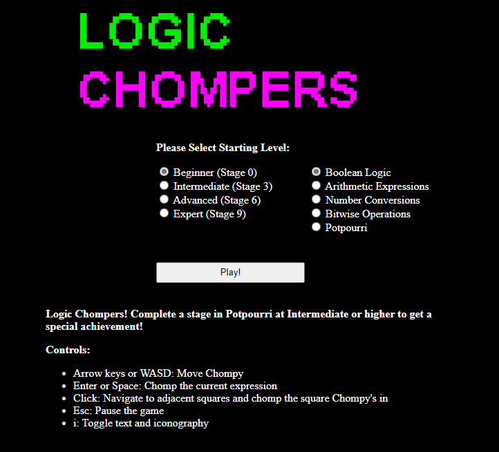
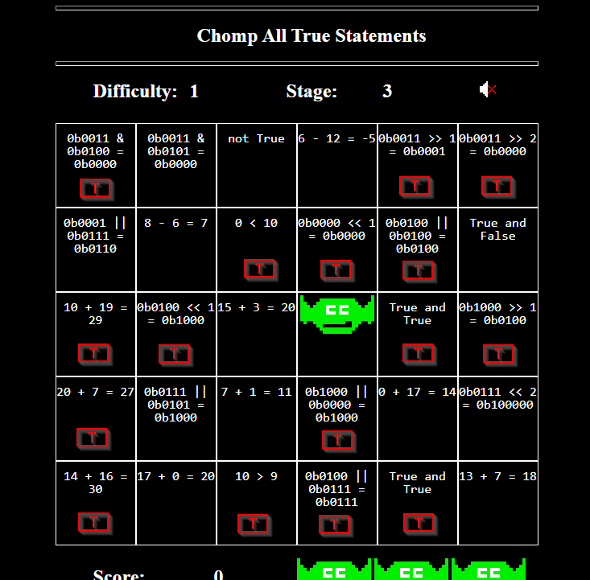
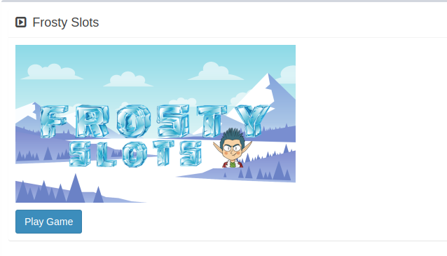
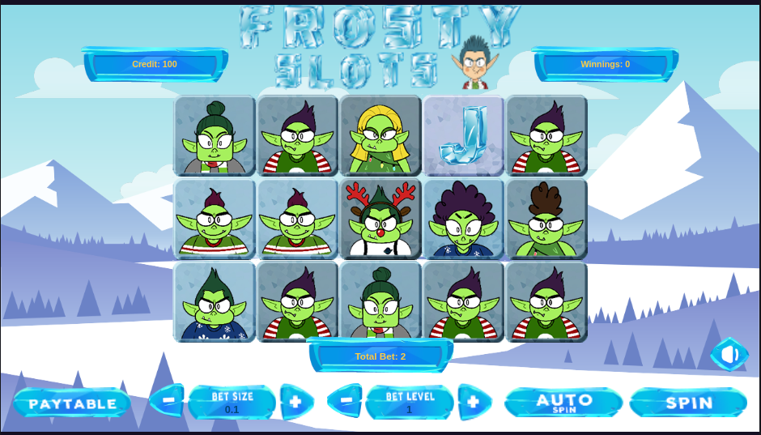
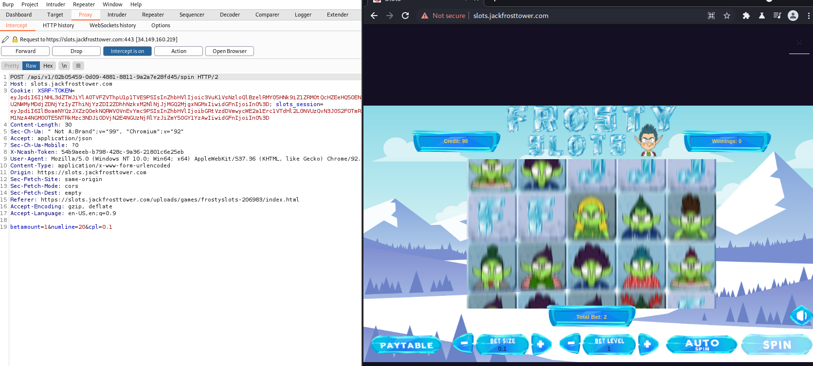
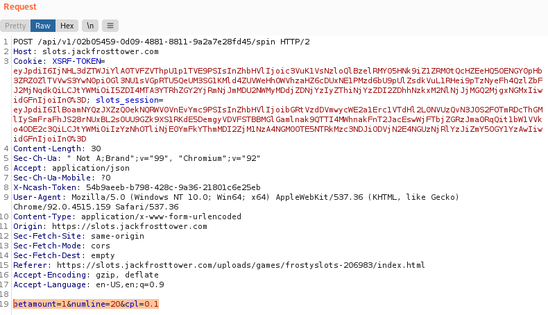
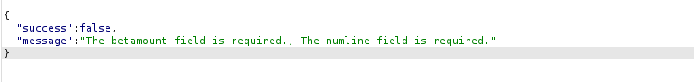
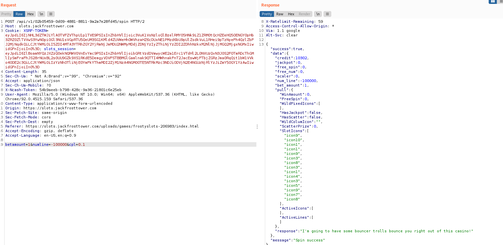

# 4) Slow Machine Investigation

> Difficulty: 2/5
> 
> Test the security of Jack Frost's [slot machines](https://slots.jackfrosttower.com/). What does the Jack Frost Tower casino security team threaten to do when your coin total exceeds 1000? Submit the string in the server data.response element. Talk to Noel Boetie outside Santa's Castle for help.

Hints Provided by Noel Boetie:  
- It seems they're susceptible to [parameter tampering](https://owasp.org/www-community/attacks/Web_Parameter_Tampering).
- Web application testers can use tools like [Burp Suite](https://portswigger.net/burp/communitydownload) or even right in the browser with Firefox's [Edit and Resend](https://itectec.com/superuser/how-to-edit-parameters-sent-through-a-form-on-the-firebug-console/) feature.

Answer: **I'm going to have some bouncer trolls bounce you right out of this casino!**

---

## Walkthrough

After completing Objective 3, access to _Frost Tower Lobby_ will be open. We can go in and interact with Jack Frost for a short introduction on what amenities in _Frost Tower_, including the slot machines which is related to the current objective.

To access into _Frost Tower Lobby_: Go back to _The North Pole_, proceed to the right to find the _Frost Tower_ and enter from the front door (only accessible after completing Objective 3).

We can click on any of the available slot machine in this room to open a new web page to play the slot machine.

Before that, we are also given clue on the objective page: to seek Noel Boetie outside _Santa's Castle_ for help. To reach him, go back to _The North Pole_ and procees left to find him standing right outside _Santa's Castle_.

---
## Solution(hint)

Talking to Noel Boetie reveals that if we can help him to **complete a stage on Potpourri game at Intermediate (stage 3) or higher**, he will provide us some tips on finding some vulnerabilities specifically in the slots machine at _Frost Tower_.

To assist Noel, start up the Logic Munchers terminal beside him:

We can see that this game has 4 stages (Beginner, Intermediate, Advanced and Expert) for 5 different modes (Boolean Logic, Arithmetic Expressions, Number Conversions, Bitwise Operations and Potpourri).  To recall. We need to complete **Potpourri on Intermediate or higher** to get the clues.

Noel also provided the following guides on Boolean logic:
- There are lots of special symbols for logic and set notation. [This one](http://notes.imt-decal.org/sets/cheat-sheet.html) covers AND, NOT, and OR at the bottom.
- [This](http://www.natna.info/English/Teaching/CSI30-materials/Chapter1-cheat-sheet.pdf) might be a handy reference too.

The game is made up of a 6x5 grid, with each cell containing a booean statement.  
The player (You)) is represented by a green figure that occupies a cell on the grid. The player's objective is to find all the cells that contains the boolean statement that equals to a **TRUE** statement.  
There is no time limit, but at random intervals, 1 or more purple figures (bad guys) will enter the grid and change the existing statement on the cell it is standing on. You have a total of 3 lives.  
The player is not allowed to touch the purple figure or stand on the same cell as the purple figure until it steps away.  
The stage competes when you have "chomped" up all the statements that are **TRUE**.

Explanation of each game mode:  
- `Boolean Logic` fills the grid with boolean logic statements like `(True or False)` or `'a'='a'`
- `Arithmetic Expressions` fills the grid with simple arithmetic equations like `5+1=6` or `3>=10`
- `Number Conversion` fills the grid with statement containing numerals, binary or hexadecimal numbers like `0x08 = 0b0110` or `0b0011 = 3` (tips: hexadecimals begin with `0x` and binary begins with `0b`)
- `Bitwise Operations` fills the grid with binary equations in combination with bit comparion and bit shift like `0b0000 & 0b0011 = 0b0000` or `0b0110 << 2 = 0b11000` (tips: `<<` means to shift all `1` bit to the left by right and `>>` shifts all `1` bit to the right)
- `Potpourri` fills the grid with any combination of statement or expressions from the other 4 game modes:  

So given the grid as above screenshot: all the `TRUE` statements are the ones with the a red `T` in the red box.

Upon completing a Potpourri game with intermediate level or above, you will get an achievement.

Talk to Noel to get the following clues:
- It seems they're susceptible to [parameter tampering](https://owasp.org/www-community/attacks/Web_Parameter_Tampering).
- Web application testers can use tools like [Burp Suite](https://portswigger.net/burp/communitydownload) or even right in the browser with Firefox's [Edit and Resend](https://itectec.com/superuser/how-to-edit-parameters-sent-through-a-form-on-the-firebug-console/) feature.

---
## Solution

Head to any one of the slot machines in the _Jack Frost Lobby_ and click it to open a new webpage to play the slot machine, or you can directly access the page [here](https://slots.jackfrosttower.com/).

Click play and you will see a slotmachine interface with some given input options:

In normal situation, no matter how you play the slot machine, you will eventually lose all your credit. Learning from what Noel taught us about Parameter Tampering, we need to use a hack to tamper with the slot machine. Below solution uses Burpsuite, but you can also do it via the Developer Tools using FireFox browser.

First we load up the burpsuite and start proxy intercept on the slot machine interface.  

Upon clicking the spin, you will get an intercept as shown in screenshot above.  
Click `Action` and click `Send to Repeater`. Then proceed to the `Repeater` tab.  

We can see that the POST request when we click on `SPIN` in the game has 3 body parameters as below:  
`betamount=1&numline=20&cpl=0.1`

if we remove all the parameters and click send, the response will prompt that we need to supply minimally a `betamount` and `numline` body parameter: 

That sort of gives us an idea that we may be able to tamper with the one of the parameters to give us more credit.

After trying out several combinations, the following can be observed:  
- `betamount` must be 0 or higher
- `numline` can only be a maximum value of 20
- amount of credit spent per game (per send request) is a total of `betamount * numline * cpl`

With that given, we can provide a negative value to either `numline` or `cpl`, so that given the equation `betamount * numline * cpl`, instead of spending credits in each spin, we will be getting credits instead!

Enter a big enough negative value for `numline` or `cpl` and you will get the following:

At the bottom of the response data, we can find the string we need to solve this objective:  

Answer: **I'm going to have some bouncer trolls bounce you right out of this casino!**

Using this, proceed to the objectives page and enter the string into the box provided at Objective 4 and you should get an achievement.