# 5) Strange USB Device

> Difficulty: 2/5
> 
> Assist the elves in reverse engineering the strange USB device. Visit Santa's Talks Floor and hit up Jewel Loggins for advice.

Hints Provided by Jewel Loggins:  
- [Ducky Script](https://docs.hak5.org/hc/en-us/articles/360010555153-Ducky-Script-the-USB-Rubber-Ducky-language) is the language for the USB Rubber Ducky
- Attackers can encode Ducky Script using a [duck encoder](https://docs.hak5.org/hc/en-us/articles/360010471234-Writing-your-first-USB-Rubber-Ducky-Payload) for delivery as `inject.bin`.
- It's also possible the reverse engineer encoded Ducky Script using [Mallard](https://github.com/dagonis/Mallard).
- The [MITRE ATT&CK™ tactic T1098.004](https://attack.mitre.org/techniques/T1098/004/) describes SSH persistence techniques through authorized keys files.

Answer: **ickymcgoop**

---
## Walkthrough

This objective requires us to reverse engineer a strange USB device. To get to this objective, we need to find Morcel Nougat, who can be found in _Speaker UNPreparation Room_.

To get to Morcel Nougat: First enter _Santa's Castle_ to the _Entry_, and click on the lift to the right of Santa. Proceed to "KringleCon Talks" on level 2, then head all the way left to the room called _Speaker UNPreparation Room_. Morcel Nougat is in this room.

Morcel Nougat has been playing with **USB Rubber Duckies** for a while, and he needs our help to solve this particular Rubber Ducky objective, using the "Strange USB Device" terminal beside him. In addition, he mentioned that Jewel Loggins just outside the room maybe provide some advice on this objective.

We can start working on this objective using the terminal beside Morcel Nougat, but first we should find Jewel Loggins, who is found in _Talks Lobby_, and ask him on more advice on this objective.

To find Jewel Loggins: First enter _Santa's Castle_ to the _Entry_, and click on the lift to the right of Santa. Proceed to "KringleCon Talks" on level 2 to find Jewel Loggins.

---
## Solution(hint)

After interacting with Jewel Loggins, he reveals that he has issues with doing simple things like Nmap and cURL using IPv6. He has asked us to take a look at it on his behalf using the IPv6 Sandbox terminal beside him, and has nicely provided the following guide to help us with this task.

- Check out this [Github Gist](https://gist.github.com/chriselgee/c1c69756e527f649d0a95b6f20337c2f) with common tools used in an IPv6 context.

Start up the Sandbox terminal:

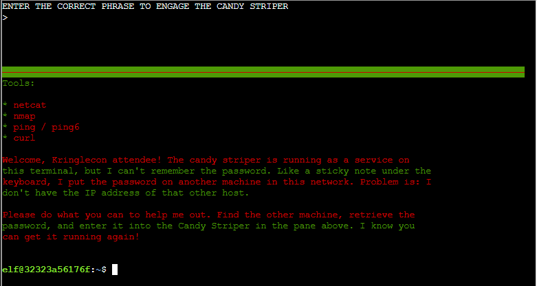

First we have to find the IPv6 address of this other machine within the same network that Jewel Loggins has kept his password on.

Following the guide provided by Jewel Loggins, we can use the following commands to find local addresses within the same network segment:  
`ping6 ff02::1 -c2`  
`ping6 ff02::2 -c2`  
`ip neigh`

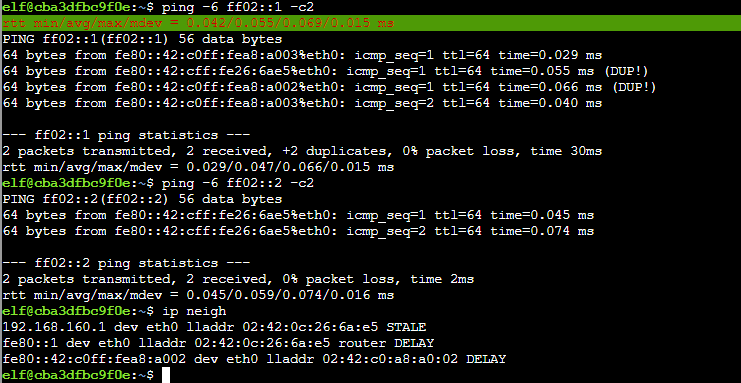

From the results, we can see that there is another IPv6 address sitting on the network: **fe80::42:c0ff:fea8:a002**.  
What we need need to use is to scan that IPv6 address for any open ports for entry point.

Use the following command to do a `nmap` scan of the IPv6 address we located:  
`nmap -6 fe80::42:c0ff:fea8:a002%eth0`

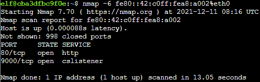

Use the following `netcat` command to listen in on the open port 9000:  
`nc -6 fe80::42:c0ff:fea8:a002%eth0 9000`

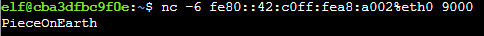

Enter the phrase into the terminal at the top panel and you will get an achievement!

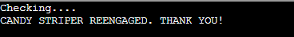

After exiting the terminal, go back to interact with Jewel Loggins and we get the the following hints for solving Objective 5:  
- [Ducky Script](https://docs.hak5.org/hc/en-us/articles/360010555153-Ducky-Script-the-USB-Rubber-Ducky-language) is the language for the USB Rubber Ducky
- Attackers can encode Ducky Script using a [duck encoder](https://docs.hak5.org/hc/en-us/articles/360010471234-Writing-your-first-USB-Rubber-Ducky-Payload) for delivery as `inject.bin`.
- It's also possible to reverse engineer encoded Ducky Script using [Mallard](https://github.com/dagonis/Mallard).
- The [MITRE ATT&CK™ tactic T1098.004](https://attack.mitre.org/techniques/T1098/004/) describes SSH persistence techniques through authorized keys files.

---
## Solution

Start up the "Strange USB Device" terminal beside Morcel Nougat in _Speaker UNPreparation Room_ on level 2 of _Santa's Castle.

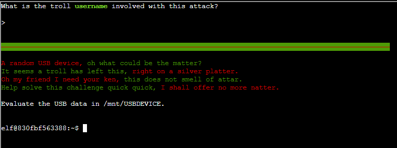

We need to evaluate the USB data found at `/mnt/USBDEVICE` and figure out the **username** involved with this Rubber Ducky attack.

Using the following command, we can find the encoded Ducky script at `/mnt/USBDEVICE`:  
`ls /mnt/USBDEVICE/`

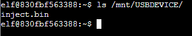

Based on the advices provided by Jewel Loggins, We know the `Mallard script` can be used to decode an encoded Ducky script. Conveniently there is a `mallard.py` prepared in the terminal by entering the `ls` command:

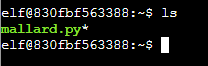

Use the following command to decode and observe the content of the encoded `inject.bin`:  
`python3 mallard.py --file /mnt/USBDEVICE/inject.bin`

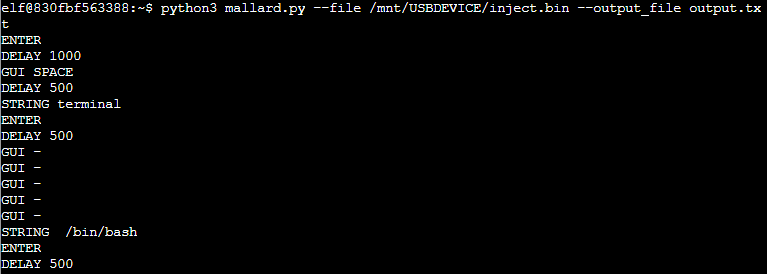

It is a rather long script with some interesting commands written within, but the most important line is at the bottom of the entire script. Scroll down to find a long command as shown:  

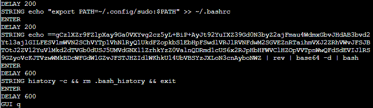

It seems to be an base64 encoded string in reverse. Use the following command to reverse the string and base64-decode it:  
`echo <string> | rev | base64 -d` (use the mouse to highlight the string and right-click to copy and paste the string in your terminal)

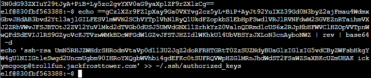

The long reverse encoded string is actually a command to push an SSH public key into the `authorized_keys` file to allow the user to gain SSH access.  
From the output, we can find the username **ickymcgoop**. Use it to enter at the top of the terminal and you will get an achievement!

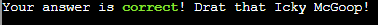