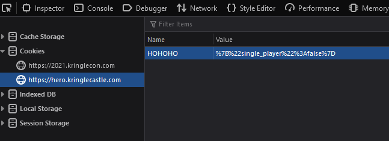
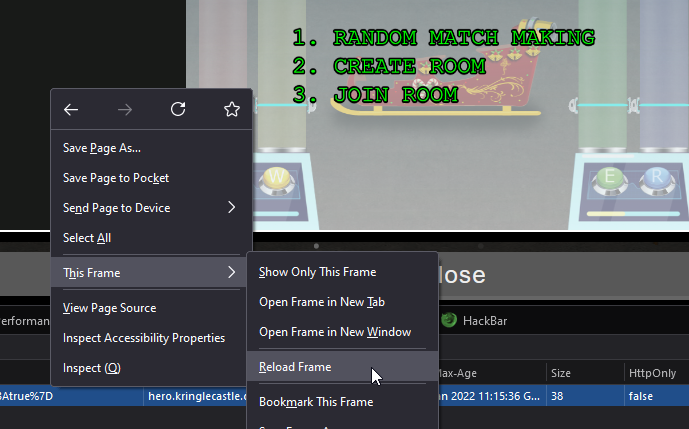

# 6) Shellcode Primer

> Difficulty: 3/5
> 
> Complete the [Shellcode Primer](https://tracer.kringlecastle.com/) in Jack's office. According to the last challenge, what is the secret to KringleCon success? "All of our speakers and organizers, providing the gift of ____, free to the community." Talk to Chimney Scissorsticks in the NetWars area for hints.

Hints Provided by Chimney Scissorsticks:  
- If you run into any shellcode primers at the North Pole, be sure to read the directions and the comments in the shellcode source!
- Also, troubleshooting shellcode can be difficult. Use the debugger step-by-step feature to watch values.
- Lastly, be careful not to overwrite any register values you need to reference later on in your shellcode.

Answer: **cyber security knowledge**

---
## Walkthrough

To solve this objective, we need to find the Shellcode Primer in _Jack's Office_.

To find the Shellcode Primer: Go to the _Frost Tower_ located on the right of _The North Pole_. Enter the _Frost Tower_ (need to complete Objective 3 first) and take the stairs at the top right side of the _Frost Tower Lobby_. You will need to keep climbing the stairs from level 1 to level 16 to reach _Jack's Office_. The Shellcode Primer is on the table beside Ruby Cyster.

First we look for Chimney Scissorsticks in the _NetWars_ area to get more hints to solve this objective.  
To find Chimney Scissorsticks: Go to the lift within the _Santa's Castle_ and proceed to "NetWars" on level R. Chimney Scissorsticks can be found in this _NetWars_ area.

---
## Solution(hint)

Chimey Scissorsticks has been hanging out and having a great time in this _NetWars_ area, and having fun  with the "Holiday Hero" terminal beside him which is supposedly used to generate some jamming holiday tunes to power Santa's sleigh. He says this game is fun to play with a friend but it is also possible to enable single player mode using some clever technique by passing a client-side value to the server.  

Either way (single or multi-player mode), he appreciates our help to fuel up the sleigh using this terminal and he will consider helping us with the objective.

**This puzzle can be solved using two players, but the following solution is solved using the single-player mode via a Firefox browser**

Click on the terminal beside him:

- `RANDOM MATCH MAKING`: Selecting this option will allow you to wait for another real player to be randomly paired with you when he/she chooses this option as well. You will need to wait if no real player is choosing this option.
- `CREATE ROOM`: This option allows you to create a room with a unique room ID and allows a second player (player 2) to join with the provided room ID.
- `JOIN ROOM`: This option allows you to join another player's room as player 2 using the room ID provided by player 1.

Seems like none of the options allows for single player, so we need to first find out how to activate single player.

Using Firefox browser, open the Developer's Tool by pressing `F12`, and look over at the `Storage` tab. Under Cookies, we can see the following:

**Note: as the game is launched in a separate iFrame, it stores a separate cookie of its own under `https://hero.kringlecast.com`**

There is a cookie with a `Name:HOHOHO` and `Value:%7B%22single_player%22%3Afalse%7D`

We can manually change the value under `single_player: false` to `single_player: true`

After this, we need to reload the game for it to take effect. Right click on the game, select this frame and choose "Reload Frame".

Next, While we have enabled single-player mode. We have not introduced a bot to play with us. So if we just start the game right now, we will still fail the game, as no one is playing as Player 2. We need to find a way to get the server to play as Player 2 for us.  
Since the only way to start a game as Player 1 is to choose the option `CREATE ROOM`, go ahead to choose the second option, and close the game instruction that popped up to reveal the game scene.  
Back at the Developer's Tool, we need to make sure we are selecting the game frame, and not the main KringleCon frame, so use the button located at the top left corner of the Developer's Tool, and click on the game frame itself.

Then, head to the `Debugger` tab on Developer's Tool to look at the `.js` assets within the game source. This part may be a bit technical and tedious, but the purpose is to find a important variable that can allow the server to trigger the server to play as Player 2 for us.  
If you manage to dig enough, you will find a single variable called `single_player_mode` which is a boolean variable that can allow the server to spawn as a Player 2 bot to play with us.  

To change the variable value, proceed to `Console` tab and enter the following command: `this.single_player_mode=true`

The moment this variable changes to `true`, you will get the following notification on the game screen:

Now all we need to do is to start the game and complete it.

With that you will get an achievement for completing the game successfully.  
Talk to Chimney Scissorsticks again to get the following hints about solving Objective 6:
- If you run into any shellcode primers at the North Pole, be sure to read the directions and the comments in the shellcode source!
- Also, troubleshooting shellcode can be difficult. Use the debugger step-by-step feature to watch values.
- Lastly, be careful not to overwrite any register values you need to reference later on in your shellcode.

---
## Solution

Start up the Shellcode Primer beside Ruby Cyster. This will open up a new webpage at this [URL](https://tracer.kringlecastle.com/).

**NOTE: for beginners to Shellcode, it is important and recommended to read the introduction and learn to write shellcode in this objective**

> Part 1: Introduction  
> Part 2: Loops

The first two lessons are for learning purposes. No changes or code writing is needed to finish these 2 lessons.  
Neverthless it is good to read through them to understand how assembly code works.

> Part 3: Getting Started

Enter the following line at the end of the code block:  
`ret`

Execute the code by clicking on the "Execute" button below, and the next part will be unlocked.

> Part 4: Returning a Value

Enter the following commands in the code block to continue:  
`mov rax, 1337`

Execute the code by clicking on the "Execute" button below, and the next part will be unlocked.

> Part 5: System Calls

To use `syscall` we need to find their respective syscall number in [this table](https://blog.rchapman.org/posts/Linux_System_Call_Table_for_x86_64/).  
Using the list, we can find the syscall number for `sys_exit` which is `60`.  
Enter the following commands in the code block:  
`mov rax, 60`  
`mov rdi, 99`

Execute the code by clicking on the "Execute" button below, and the next part will be unlocked.

> Part 6: Calling Into The Void

This lesson just has to run the code with no modification to learn what happens when shellcode crashes.

> Part 7: Getting RIP

Enter the following command below the `;TODO` line:  
`pop rax`

Execute the code by clicking on the "Execute" button below, and the next part will be unlocked.

> Part 8: Hello, World!

Enter the following command at the start:  
`call jump_over`

Enter the following commands below the `; This would be a good place for a label and a pop` line:  
`call jump_over`  
`pop rax`

Execute the code by clicking on the "Execute" button below, and the next part will be unlocked.

> Part 9: Hello, World!!

To call `sys_write`, find its respective syscall number in [this table](https://blog.rchapman.org/posts/Linux_System_Call_Table_for_x86_64/), which is the value of `1`.  
Notice that for `sys_write`, it requires 3 arguments in respectively `rdi`, `rsi`, and `rdx` registers:  
- `rdi` is to specify where to write to
- `rsi` to specify the buffer string to write
- `rdx` to specify how long of the buffer string to write

Enter the following commands in the necessary order within the code block as shown in screenshot below:  
`call getString`  
`getString:`  
`mov rax,1` - `sys_write` syscall number is 1.
`mov rdi,1` - stdout's file descriptor is 1.  
`pop rsi` - pop the buffer string to `rsi` because `sys_write` writes the buffer string stored in `rsi`  
`mov rdx,12` - value 12 because the string `Hello World!` is 12 chars long.

Execute the code by clicking on the "Execute" button below, and the next part will be unlocked.

> Part 10: Opening a File

To call `sys_read`, its respective syscall number is the value of `0`.  
Notice that for `sys_open`, it also requires 3 arguments in respectively `rdi`, `rsi`, and `rdx` registers:  
- `rdi` is to specify what filename to open
- `rsi` to specify the flags (not needed for this exercise so can set to value 0)
- `rdx` to specify the mode (not needed for this exercise so can set to value 0)

Enter the following commands in the necessary order within the code block as shown in screenshot below:  
`call getFile`  
`getFile:`  
`mov rax,2` - `sys_open` syscall number is 2.  
`pop rdi` - pop filename to rdi  
`mov rsi,0` - not needed so value set to 0  
`mov rdx,0` - not needed so value set to 0

Execute the code by clicking on the "Execute" button below, and the next part will be unlocked.

> Part 11: Reading a File

As the last challenge, you need to call 4 syscalls to complete this challenge.  
To recap from previous challenges:  
- `sys_open` requires a syscall number of `2`  
- `sys_write` requires a syscall number of `1`  
- `sys_exit` requires a syscall number of `60`
- The new syscall we need: `sys_read` requires a syscall number of `0`

For `sys_read` we will need the following 3 arguments as well:
- `rdi` to specify the file descriptor which is returned by `sys_open` in this challenge
- `rsi` specifies the buffer for reading the file, which we will use `rsp` in this challenge
- `rdx` the count/size of the buffer needed, we will use an arbitrary value of 200.

Enter the following commands in the necesary order as shown in screenshot below:
`call getFile`  
`getFile:`  
`mov rax,2` - syscall number for `sys_open`  
`pop rdi` - pop filename to rdi  
`syscall` - call `sys_open`  
`mov rdi,rax` - move file descriptor returned from `sys_open` into `sys_read`  
`mov rax,0` - syscall number for `sys_read`  
`mov rsi,rsp` - using `rsp` as the buffer to read and store the file content  
`mov rdx,200`  
`syscall` - call `sys_read`  
`mov rdx,rax` - count size of `sys_write` to follow return value from `sys_read`  
`mov rax,1` - syscall number for `sys_write`  
`mov rdi,1` - file descriptor for stdout is always `1`  
`syscall` - call `sys_write`  
`mov rax,60` - syscall number for `sys_exit`  
`mov rdi,99` - exit code of 99  
`syscall` - call `sys_exit`

Execute the code by clicking on the "Execute" button below, and you will get the following stdout:

**Secret to KringleCon success: all of our speakers and organizers, providing the gift of cyber security knowledge, free to the community.**

Head back to KringleCon and open inventory and proceed to Objective 6 to submit the answer: **cyber security knowledge**

With that, you will receive an achievement.