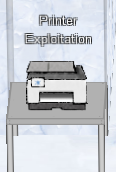

# 7) Printer Exploitation

> Difficulty: 4/5
> 
> Investigate the stolen [Kringle Castle printer](https://printer.kringlecastle.com/). Get shell access to read the contents of `/var/spool/printer.log`. What is the name of the last file printed (with a `.xlsx` extension)? Find Ruby Cyster in Jack's office for help with this objective.

Hints Provided by Ruby Cyster:  
- When analyzing a device, it's always a good idea to pick apart the firmware. Sometimes these things come down Base64-encoded.
- [Hash Extension Attacks](https://blog.skullsecurity.org/2012/everything-you-need-to-know-about-hash-length-extension-attacks) can be super handy when there's some type of validation to be circumvented.
- Files placed in `/app/lib/public/incoming` will be accessible under https://printer.kringlecastle.com/incoming/.

Answer: ****

---
## Walkthrough

To solve this objective, we need to find the Printer in _Jack's Office_.

To find the Printer: Go to the _Frost Tower_ located on the right of _The North Pole_. Enter the _Frost Tower_ (need to complete Objective 3 first) and take the stairs at the top right side of the _Frost Tower Lobby_. You will need to keep climbing the stairs from level 1 to level 16 to reach _Jack's Office_. The Printer is right on the table near the door to _Jack's Studio_.

First we should talk to Ruby Cyster, who is also in _Jack's Office_ for more help with this objective.  
To find Ruby Cyster: She is exactly in the same room (_Jack's Office_) as the printer.

---
## Solution(hint)

Ruby Cyster suspects that someone is learning how to hack the North Pole systems. We should help her to find out who that someone is.  
To get clue from her, you need to solve [Objective 06 - Shellcode Primer](../Obj06-Shellcode_Primer/README.md).  
Then, she will provide the following advices:  
- When analyzing a device, it's always a good idea to pick apart the firmware. Sometimes these things come down Base64-encoded.
- [Hash Extension Attacks](https://blog.skullsecurity.org/2012/everything-you-need-to-know-about-hash-length-extension-attacks) can be super handy when there's some type of validation to be circumvented.
- Files placed in `/app/lib/public/incoming` will be accessible under https://printer.kringlecastle.com/incoming/.

---
# INCOMPLETE
## Solution
