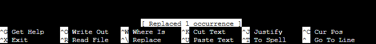
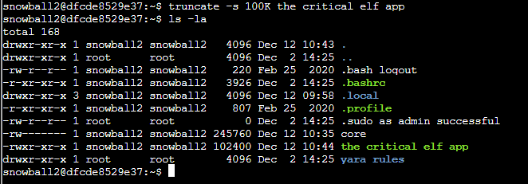
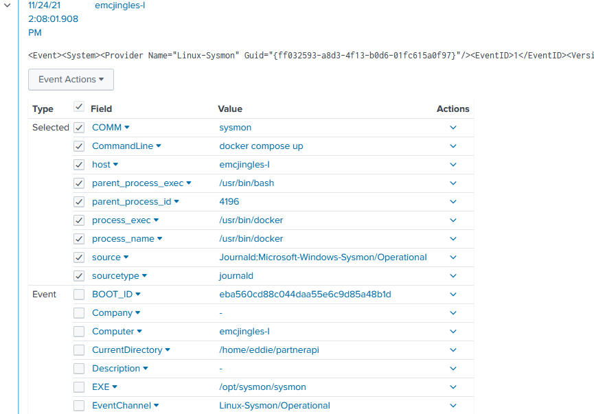

# 9) Splunk!

> Difficulty: 3/5
> 
> Help Angel Candysalt solve the Splunk challenge in Santa's great hall. Fitzy Shortstack is in Santa's lobby, and he knows a few things about Splunk. What does Santa call you when when you complete the analysis?

Hints Provided by Fitzy Shortstack:  
- Between GitHub audit log and webhook event recording, you can monitor all activity in a repository, including common `git` commands such as `git add`, `git status`, and `git commit`.
- Sysmon network events don't reveal the process parent ID for example. Fortunately, we can pivot with a query to investigate process creation events once you get a process ID.
- Did you know there are multiple versions of the Netcat command that can be used maliciously? `nc.openbsd`, for example.

Answer: **whiz**

---
## Walkthrough

We need to help Angel Candysalt solve her Splunk challenge for this objective. She can be found at _Santa's Great Room_.  
To find Angel Candysalt: Go to the _Santa's Castle_ located on the left of _The North Pole_. Enter the _Santa's Castle_ and proceed to the room on the right to reach _Santa's Great Room_, and she will be standing in the middle of the room.

Before we carry on, we should talk to Fitzy Shortstack, who is also in _Entry_ at _Santa's Castle_ to learn more about Splunk.  
To find Ruby Cyster: She is in the main hall of _Santa's Castle_ called _Entry_, located on the left of _The North Pole_.

---
## Solution(hint)

First interact with Fitzy Shortstack who is in the _Entry_ room of the _Santa's Castle_.  
He seems a little worried about attach threats from the other con next door, and requests our help to solve the issues in the "Yara Analysis" Cranberry Pi terminal beside him so he can learn and understand YARA rules better. Helping him will also get him to give us more tips for Splunk.

Start up the terminal:

From the introduction, seems like there is a yara rule triggered which is preventing from the critical application from functioning properly.  
We should try to identify the rule, understand the syntax, then change the program so that the rule will not trigger and thereby bypass the scanner.  
The following commands might be useful to get this application going:
- `vim`: The vim text editor for making any changes to a file
- `emacs`: another text editor
- `nano`: another text editor
- `yara`: the command to invoke the yara scanner. Requires two things: a file with the rules to use, and the target to be scanned.
- `xxd`: creates a hex dump of a given file or standard input

We can first run the following command to execute the application and see what yara rule(s) has been triggered:  
`./the critical elf app`  
**NOTE: try to use the `tab` key to auto-complete the command as self inputting the `space` key will render error in recogning the filename**

We see that the yara rule 135 has been flagged. Next we should take a closer look at what yara rule 135 states.  
Run the following command to open the yara rules file and then scroll down to find yara rule 135:  
`nano yara rules/rules.yar` (you can use `vim`, `emacs` or `nano`)

The yara rule 135 specifically looks for the string "candycane", so let's try to avoid that keyword in the application.  
Use the following command to open the application and look for `candycane`:  
`nano the critical elf app`  

Use the following shortcut keys to find and replace the word `candycane`:  
`CTRL + \` --this will allow you to enter a string to search in the file, and will ask for another string to replace the previous string  
key in `candycane` --string to search for in the file  
key in `123456789` --string to replace the `candycane` string.  
**NOTE: you can use any string to replace the `candycane` string, but make sure it is of the same length as `candycane`!**

Once you done that, it will look for any occurence of the keyword `candycane`, which happens to be 1 occurence, and will ask if you want to replace this instance with the keyword you have supplied. press `Y` or `A` to replace and continue.

Exit from the nano editor using `CTRL + X`, and press `Y` followed by `ENTER` to save the changes.  
Run the following command again to execute the application and see if it works:  
`./the critical elf app`  

This time it triggers yara rule 1056. Repeat the same process and take a look at the yara rule 1056 setting:  
`nano yara rules/rules.yar` (you can use `vim`, `emacs` or `nano`)

This time it looks for 2 hexadecimal strings:  `6c 6962 632e 736f 2e36` and `726f 6772 616d 2121`  
We need to reverse the hexadecimal to see what these strings represent in the application.  
Enter the following commands to find out the reverse values of these hexadecimal strings:  
`xxd -r`  --to reverse the hexdump operation from hexdump to binary
`6c 6962 632e 736f 2e36` -- yields `ibc.so.6`
`726f 6772 616d 2121` -- yields `gram!!`

We may not be able to edit the string `ibc.so.6`, as that is needed to load and run some libraries for the application to work. But that is okay, as yara rule 1056 only triggers when both strings are detected, so we just need to make 1 change to the other string, and we can bypass yara rule 1056.  
So let's repeat the same process as before to replace these the second string within the application with something of equivalent length.  
`nano the critical elf app`  
`CTRL + \`  
key in `gram!!` --to search for  
key in `1234!!`  --to replace with  
`Y` or `A` --to confirm replacement  
`CTRL + X`, `Y`, `ENTER` to save and exit from nano editor  
`./the critical elf app` to test the application again.

Now this time it triggers yara rule 1732. Repeat the same process to find out what yara rule 1732 is about:  
`nano yara rules/rules.yar` (you can use `vim`, `emacs` or `nano`)

this time we can bypass the rule by making the filesize to 50KB or bigger.  
We can do this simply by using the `truncate` command:  
`truncate -s 100K the critical elf app`

Execute the application again to see if it works.

The application finally works successfully, and we get an achievement!  
In addition, Fitzy Shortstack will provide us with the following tips for Splunk:  
- Between GitHub audit log and webhook event recording, you can monitor all activity in a repository, including common `git` commands such as `git add`, `git status`, and `git commit`.
- Sysmon network events don't reveal the process parent ID for example. Fortunately, we can pivot with a query to investigate process creation events once you get a process ID.
- Did you know there are multiple versions of the Netcat command that can be used maliciously? `nc.openbsd`, for example.

---
## Solution

The Splunk terminal beside Angel Candysalt is the key to solving this objective. We need to complete a series of challenges put up in this terminal and get the final answer to enter into the Objectives panel to complete this objective.

Start up the terminal, which will open up a new browser page.

You may go through the `6 Sample Splunk Searches` for introduction and learning about splunk searches. The following will provide solutions to all the tasks in the TO-DO list:

> Task 1: Capture the commands Eddie ran most often, starting with git. Looking only at his process launches as reported by Sysmon, record the most common git-related CommandLine that Eddie seemed to use. 

Run the following search query to get the answer:  
`source="Journald:Microsoft-Windows-Sysmon/Operational" process_exec="/usr/bin/git"| top limit=5 CommandLine`

Answer: **git status**

> Task 2: Looking through the git commands Eddie ran, determine the remote repository that he configured as the origin for the 'partnerapi' repo. The correct one!

Run the following search query to get the answer:  
`source="Journald:Microsoft-Windows-Sysmon/Operational" process_exec="/usr/bin/git" CommandLine="git remote *"`  
NOTE: take the latest `.git` as the correct one

Answer: **git@github.com:elfnp3/partnerapi.git**

> Task 3: The 'partnerapi' project that Eddie worked on uses Docker. Gather the full docker command line that Eddie used to start the 'partnerapi' project on his workstation.

Run the following search query to get the answer:  
`source="Journald:Microsoft-Windows-Sysmon/Operational" process_exec="/usr/bin/docker" CommandLine="*"`  
Look for the first/earliest docker command ran.

Answer: **docker compose up**

> Task 4: Eddie had been testing automated static application security testing (SAST) in GitHub. Vulnerability reports have been coming into Splunk in JSON format via GitHub webhooks. Search all the events in the main index in Splunk and use the sourcetype field to locate these reports. Determine the URL of the vulnerable GitHub repository that the elves cloned for testing and document it here. You will need to search outside of Splunk (try GitHub) for the original name of the repository.

Run the following search query:  
`index=main sourcetype=github_json action=created`  
Expand into any of the events and notice a repeated github user called `elfnp3` in the event details.  

Google search for `github elfnp3` and a interesting URL appears: `https://githubmemory.com/repo/snoopysecurity/dvws-node/activity`  
Near the bottom we can see that **elfnp3 forked snoopysecurity/dvws-node**.  

Click into the [snoopysecurity/dvws-node](https://githubmemory.com/repo/snoopysecurity/dvws-node), and further probing, we will find the actual URL of the vulnerable Github repository

Answer: **https://github.com/snoopysecurity/dvws-node**

> Task 5: Santa asked Eddie to add a JavaScript library from NPM to the 'partnerapi' project. Determine the name of the library and record it here for our workshop documentation.

Run the following search query to get the answer:  
`index=main process_exec="*node" CommandLine="*npm install *"`  

Answer: **holiday-utils-js**

> Task 6: Another elf started gathering a baseline of the network activity that Eddie generated. Start with [their search](https://hhc21.bossworkshops.io/en-US/app/SA-hhc/search?q=search%20index%3Dmain%20sourcetype%3Djournald%20source%3DJournald%3AMicrosoft-Windows-Sysmon%2FOperational%20EventCode%3D3%20user%3Deddie%20NOT%20dest_ip%20IN%20(127.0.0.*)%20NOT%20dest_port%20IN%20(22%2C53%2C80%2C443)%20%0A%7C%20stats%20count%20by%20dest_ip%20dest_port&display.page.search.mode=smart&dispatch.sample_ratio=1&workload_pool=&earliest=0&latest=now) and capture the full process_name field of anything that looks suspicious.

First open the link provided in the task with the given search query:  
`index=main sourcetype=journald source=Journald:Microsoft-Windows-Sysmon/Operational EventCode=3 user=eddie NOT dest_ip IN (127.0.0.*) NOT dest_port IN (22,53,80,443) | stats count by dest_ip dest_port`

Check the events related to the IP `54.175.69.219` by clicking the IP and click `View events`.  

On the left, click on `process_name` and note the only process_name that looks suspicious. 

Answer: **/usr/bin/nc.openbsd**

> Task 7: Uh oh. This documentation exercise just turned into an investigation. Starting with the process identified in the previous task, look for additional suspicious commands launched by the same parent process. One thing to know about these Sysmon events is that Network connection events don't indicate the parent process ID, but Process creation events do! Determine the number of files that were accessed by a related process and record it here.

Enter the following search query obtained from task 6:  
`process_name="/usr/bin/nc.openbsd"` 

Click on the `parent_process_id` on the left, and click on the value `6788` to add into the search. Then remove the line `process_name="/usr/bin/nc.openbsd"` from the search bar. So the search query should look like this:  
`parent_process_id=6788`

Click on the `CommandLine` on the left to review a long value that is trying to read the contents of multiple files:  
`cat /home/eddie/.aws/credentials /home/eddie/.ssh/authorized_keys /home/eddie/.ssh/config /home/eddie/.ssh/eddie /home/eddie/.ssh/eddie.pub /home/eddie/.ssh/known_hosts`

Answer: **6**

> Task 8: Use Splunk and Sysmon Process creation data to identify the name of the Bash script that accessed sensitive files and (likely) transmitted them to a remote IP address. 

Since we know it needs to use the `bash` command to run the bash script. we can search for parent process exec as bash and parent command line with `.sh`.  
Run the following search query to find the bash script:  
`parent_process_exec="/usr/bin/bash" ParentCommandLine="*.sh"`

Answer: **preinstall.sh**

With all the tasks answered, we will get the phrase to enter into the objective field back in our inventory to clear the objective:  

Answer: **whiz**