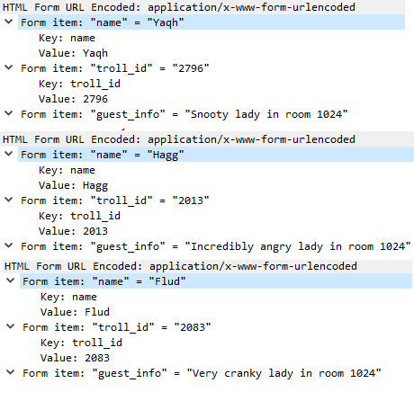

# 11) Customer Complaint Analysis

> Difficulty: 2/5
> 
> A human has accessed the Jack Frost Tower network with a non-compliant host. [Which three trolls complained about the human](https://downloads.holidayhackchallenge.com/2021/jackfrosttower-network.zip)? Enter the troll names in alphabetical order separated by spaces. Talk to Tinsel Upatree in the kitchen for hints.

Hints Provided by Tinsel Upatree:  
- [RFC3514](https://datatracker.ietf.org/doc/html/rfc3514) defines the usage of the "Evil Bit" in IPv4 headers.
- Different from BPF capture filters, Wireshark's [display filters](https://wiki.wireshark.org/DisplayFilters) can find text with the `contains` keyword - and evil bits with `ip.flags.rb`.

Answer: **Flud Hagg Yaqh**

---
## Walkthrough

To solve this objective, we need to download the zipfile obtained from the link provided in the objective, or [here](./jackfrosttower-network.zip).

We can first talk to Tinsel Upatree in the _Kitchen_ for more hints with this objective.  
To find Tinsel Upatree: First enter into _Entry_ room at _Santa's Castle_, then take one of the following routes:
1. walk left to _Dining Room_, go a bit north and then take the exit to the right to _Kitchen_.
2. walk right to _Great Room_, go a bit north and then take the exit to the left to _Kitchen_.

---
## Solution(hint)

Tinsel Upatree needs our help to find a missing file using the `strace` or `ltrace` commands in the "Strace Ltrace Retrace" terminal located beside him. If we solve his task for him, we will get more hints about using Wireshark filters to look for unusual options or patterns that can help complete this Objective 11.

Start up the terminal:

Run the following command to do an `ltrace` on the program:  
`ltrace ./make the candy`  
**NOTE: use the `tab` key to auto-complete the name of the application, as `space` key will not be recognised**

From the error, the program is trying to open a `registration.json` file which cannot be found, hence the programm failed. Thus we need to create a `registration.json`:  
`echo "{}" >> registration.json` --to create the file and write "{}" within 
`ltrace ./make the candy` --to trace the program again  

the program opened the json file successfully, but upon reading the file, it's trying to do a string compare to fetch for the word "Registration".  
Because our `registration.json` file does not cotain the word "Registration", the program failed.  
Run the following commands to input "Registration" into the json file:  
`echo "Registration" >> registration.json`  
`ltrace ./make the candy`

This time it looks for ":" right after the word "Registration" but failed.  
Enter the following command and try again:  
`echo "Registration:" >> registration.json`  
`ltrace ./make the candy`

This time it is looking for "True" but failed.  
Enter the following command and try again:  
`echo "Registration:True" >> registration.json`  
`ltrace ./make the candy`

This time, the program successfuly executes and we will get an achievement!  
Upon interacting with Tinsel Upatree after finishing his task, he will provide the following hints:
- [RFC3514](https://datatracker.ietf.org/doc/html/rfc3514) defines the usage of the "Evil Bit" in IPv4 headers.
- Different from BPF capture filters, Wireshark's [display filters](https://wiki.wireshark.org/DisplayFilters) can find text with the `contains` keyword - and evil bits with `ip.flags.rb`.

---
## Solution

Download the zipfile [here](./jackfrosttower-network.zip), and unzip it to get a `.pcap` file.

Launch the `.pcap` file using Wireshark.

Using the hints provided, we can narrow down the search by using `ip.flags.rb` and `contains` keyword.

`ip.flags.rb` will allow us to narrow down for packets that contain the evil bit, while `contains` can allow us to look for forms in the HTTP requests that contains the `name` keyword to search for the troll names.

Enter the following search query in Wireshark:
`ip.flags.rb==0 && http contains name`

There is one guest complaint here with the name `Muffy Vonduchess Sebastian`, clearly a human which suggests that this could be the human that has accessed the Jack Frost Tower network with a non-compliant host. Note her room value: `1024`.  
Now we are going to look for complaints from the trolls identified with this human or her room ID.

Enter the following search query in Wireshark:
`ip.flags.rb==1 && http contains name`

Now look through each of the filtered packet and expand the `HTML Form` portion to find the names and figure out which 3 trolls are complaining about a the lady staying at room 1024.  

Answer: **Flud Hagg Yaqh**

Rearrange the names in alphabetical order and you will get the answer. Enter into the objective field and get an achievement!
