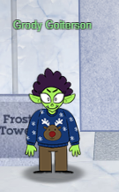
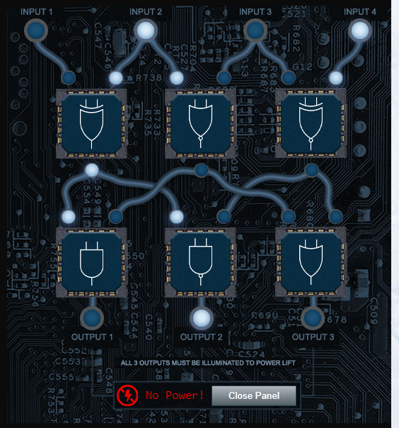
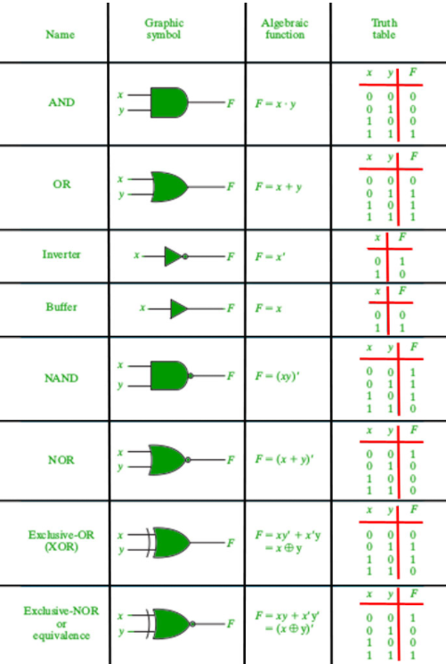
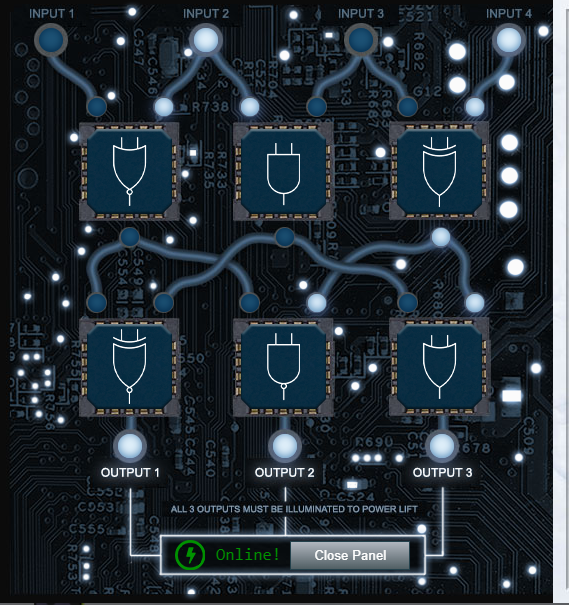
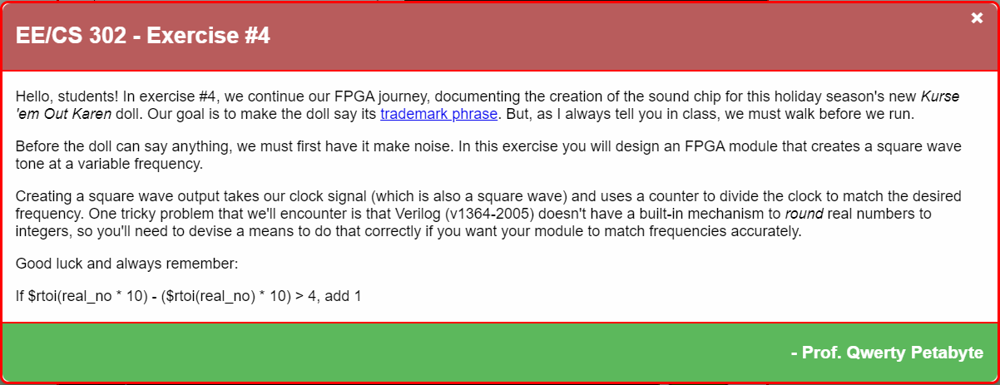

# 13) FPGA Programming

> Difficulty: 42/5
> 
> Write your first FPGA program to make a doll sing. You might get some suggestions from Grody Goiterson, near Jack's elevator.

Hints Provided by Grody Goiterson:  
- There are [FPGA enthusiast sites](https://www.fpga4fun.com/MusicBox.html).
- Prof. Qwerty Petabyte is giving [a lesson](https://www.youtube.com/watch?v=GFdG1PJ4QjA) about Field Programmable Gate Arrays (FPGAs).

Answer: **F**

---
## Walkthrough

You can find the objective by talking to Crunchy Squishter, who is on the _Frost Tower Rooftop_.  
To get to Crunchy Squishter, Go to _Frost Tower_ on the right of _The North Pole_, enter the building, and get to the top via one of these 2 ways:
1. if you have not fixed the elevator, enter the stairs located at the top right. From the stairs, go all the way up to the highest level and you will reach the _Frost Tower Rooftop_ after passing level 16.
2. if you have fixed the elevator, just press the elevator and click on _Jack's Office_. From there, exit to the stairs at the far right of the room, and go up one floor to reach the _Frost Tower Rooftop_.

You can first reach out to Grody Goiterson for more hints. She can be found near the Jack's Elevator at _Frost Tower Lobby_.  
To get to Grody Goiterson: Go to _Frost Tower_ on the right of _The North Pole_, enter the building, and you will see her near the elevator.

---
## Solution(hint)

Interacting with Grody Goiterson will reveal that she tried to fix the elevator beside her but it still isnt working. The elevator runs on some logic chips that are mixed up. If we help her with the elevator, she will provide us help with the objective.

She also provided us a quick guide on logic gates [here](https://www.geeksforgeeks.org/introduction-of-logic-gates/). 

Click on the elevator, and click on the **Open Panel** button:

To solve this, we need to know what each of the logic gate represents. Luckily we have that covered:  

So we have a total of 6 different gates on the panel.  
From the top left to the top right, we have `XOR`, `NOR` and `XNOR` gates. Bottom left to bottom right we have `AND`, `NAND`, and `OR` gates.  
We have a total of 4 `INPUTS`: numbered 1 to 4 at the top.  
Our obective: **ALL 3 OUTPUTS MUST BE ILLUMINATED TO POWER LIFT**

After some rearrangement, you will get the answer with the following arrangement:  
Top left to right: `NOR`, `AND`, `XOR`  
Bottom left to right: `XNOR`, `NAN`, `OR`

**NOTE: There are be more than 1 arrangement to get this lift working! Try the various combinations out!**

After fixing the elevator, talk to Grody Goiterson to get the following hints:
- There are [FPGA enthusiast sites](https://www.fpga4fun.com/MusicBox.html).
- Prof. Qwerty Petabyte is giving [a lesson](https://www.youtube.com/watch?v=GFdG1PJ4QjA) about Field Programmable Gate Arrays (FPGAs).

---
# INCOMPLETE
## Solution

At the _Frost Tower Rooftop_, open up the FPGA Programming terminal beside Crunchy Squishter.

**NOTE: If $rtoi(real_no * 10) - ($rtoi(real_no) * 10) > 4, add 1**